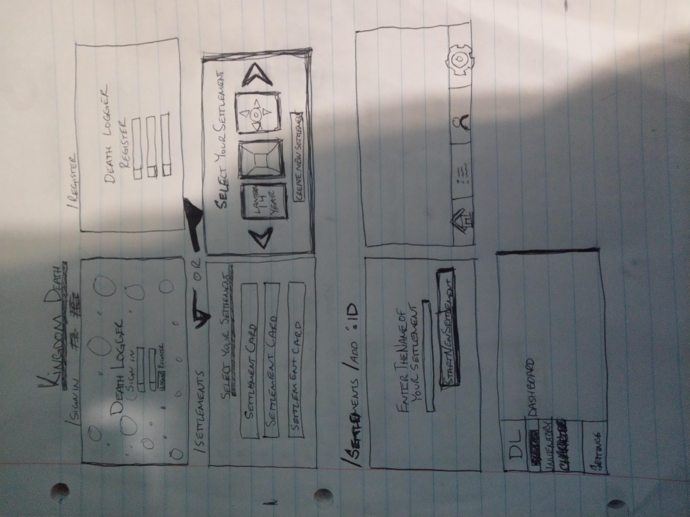
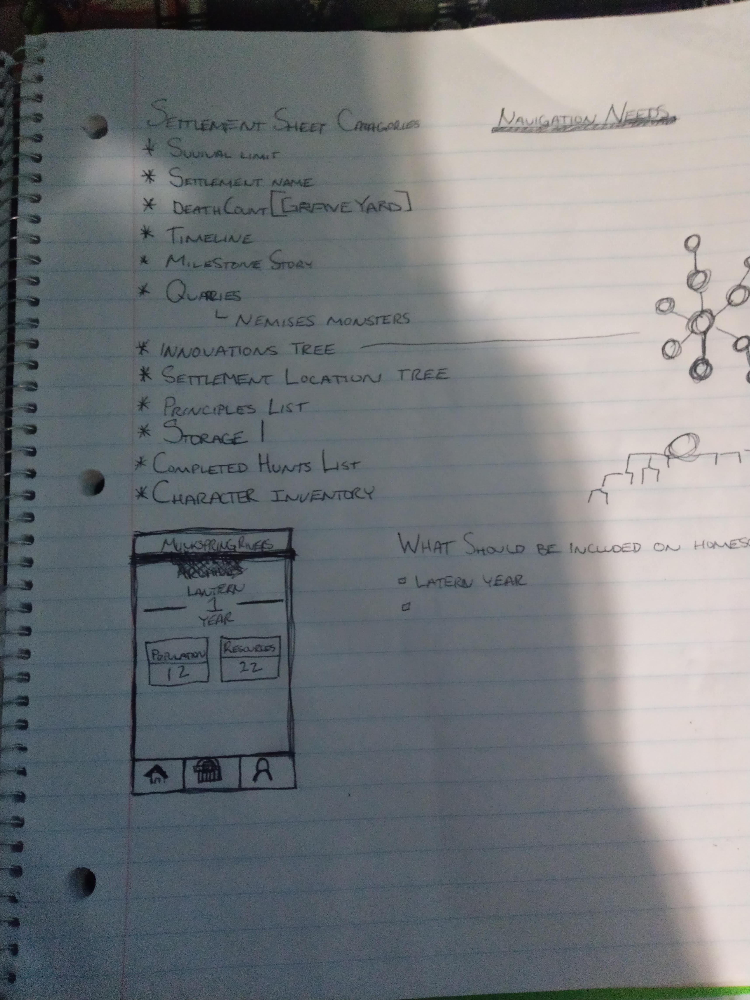

# The Lantern Archives
  ## Friday Work
    *8am-10am Defining MVP Features and what they'll need.
    10am-12pm Researched similar Apps to test out. Read about the KingdomDeathAPI considering using it for the RandomName and RandomSettlementName functionality,
    Used the Demo for Particle JS to create Background for Welcome Screen effect that I'm going to try to implement into desktop version.
    1pm - 2pm  Made sketches of Pages. 
    2pm - 5pm Used Figma to create starting wireframes.
    Wireframes can be viewed at 
    https://www.figma.com/file/ek2PJS33Nogdp7YiKwOnGr85/Kingdom-Death-Manager?node-id=0%3A1

## Description -
   The Lantern Archives is a campaign management system for the board game Kingdom Death. Lantern Archives main purpose is
   to track Resources for your in-game Settlement and provide viewable character sheets for the survivors of your settlement across different play sessions.

## Tecnologies Used -
   *Webpack
   *React
   *React-Router
   *StyleJSX

   Potentially
   *ParticleJS
   *KingdomDeathAPI

## Main Development -
    [x] Make a list of all MVP features
    [x] Research Needed Technologies for MVP
    [x] Sketch Pages for MVP
    [1/2] Wireframe pages for MVP
    [] Component tree | Actions List | State Plan
    [] Begin Development [Revisit and create action plan for development]

## Strech Goals
    [] Equipment Crafter feature
    [] Graveyard feature
    [] Timeline feature

## Component Structure

